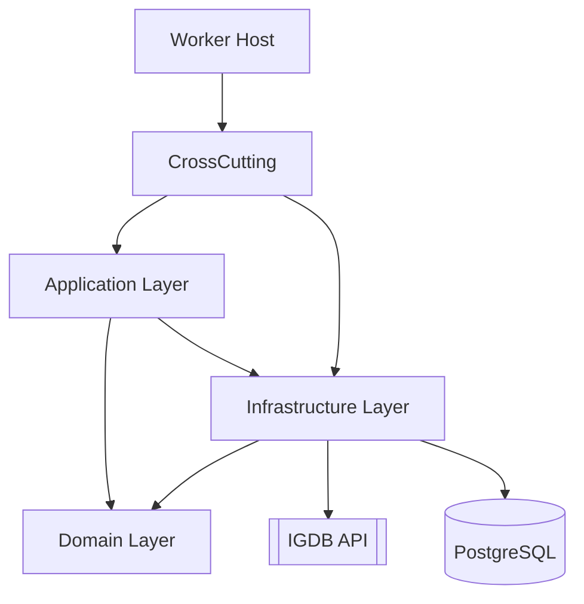

<div align="center">

# xgplib

<strong>IGDB Data Synchronization Service (Clean Architecture, .NET 9 Worker)</strong><br/>
Synchronizes games, genres and related reference data from the IGDB API (via Twitch authentication) into a local PostgreSQL database on a recurring schedule.

<!-- Badges (add/adjust as CI & packaging evolve) -->


</div>

## Table of Contents
- [xgplib](#xgplib)
  - [Table of Contents](#table-of-contents)
  - [Project Purpose](#project-purpose)
  - [Technology Stack](#technology-stack)
  - [Architecture Overview](#architecture-overview)
  - [Key Features](#key-features)
  - [Project Structure](#project-structure)
  - [Getting Started](#getting-started)
    - [Prerequisites](#prerequisites)
    - [Configuration](#configuration)
    - [Build \& Run](#build--run)
  - [Development Workflow](#development-workflow)
  - [Coding Standards](#coding-standards)
  - [Testing](#testing)
  - [Contributing](#contributing)
  - [License](#license)

## Project Purpose
The goal of this service is to reliably ingest and persist curated data from the IGDB platform (games, genres, metadata) into a local PostgreSQL store for downstream consumption (analytics, APIs, enrichment, search indexing, etc.). It runs as a long-lived background worker that periodically queries IGDB using paged requests and upserts domain entities.

## Technology Stack
- .NET 9 Worker Service (Console Host + `BackgroundService`)
- C# 13 language features
- Clean Architecture layering (Domain / Application / Infrastructure / CrossCutting / Host)
- Entity Framework Core (with PostgreSQL provider + snake_case naming convention)
- PostgreSQL (JSONB columns for raw API payload retention)
- Serilog + Microsoft.Extensions.Logging abstractions
- HttpClient factory with delegating handler for Twitch OAuth (IGDB auth flow)
- System.Text.Json for (de)serialization

## Architecture Overview
The solution follows a Clean Architecture approach:



Key interaction flow:
1. `IgdbSyncWorker` triggers at a fixed interval (currently every hour).
2. It resolves and executes `SyncGamesUseCase` and `SyncGenresUseCase` in parallel.
3. Use cases call `IIgdbService` which issues paginated POST queries to IGDB endpoints (games, genres).
4. Raw responses are mapped to domain entities (`Game`, `Genre`) preserving the original payload in JSONB `Data` fields.
5. Repositories perform add-or-update operations (idempotent synchronization) within EF Core.
6. Auditing fields (`CreatedAt`, `ModifiedAt`, etc.) are updated transparently by the DbContext.

## Key Features
- Hourly background synchronization loop (configurable in code; can be externalized later).
- Parallel fetching of games and genres for efficiency.
- Paged IGDB data retrieval (auto-continues until no further items returned).
- Token management with cached Twitch OAuth bearer tokens (semaphore-protected refresh logic).
- Clean separation of concerns (no business logic in the host or worker class beyond orchestration).
- JSONB raw payload storage for flexible downstream reprocessing.
- Structured logging for each synchronization cycle (start, counts, elapsed time, errors).
- Dependency Injection for all services, use cases, repositories and handlers.

## Project Structure
```
src/
	XgpLib.SyncService/                 # Worker host (entry point, hosted services, config)
	XgpLib.SyncService.Domain/          # Entities (Game, Genre, AuditableEntity, etc.) + interfaces
	XgpLib.SyncService.Application/     # Use cases (SyncGames, SyncGenres), DTOs, service contracts
	XgpLib.SyncService.Infrastructure/  # EF Core DbContext, Repositories, Http handlers, Services
	XgpLib.SyncService.CrossCutting/    # Dependency injection extension & shared registrations
	XgpLib.SyncService.Contracts/       # (Reserved for message contracts / external boundaries)
```

## Getting Started

### Prerequisites
- .NET 9 SDK
- A running PostgreSQL instance
- IGDB / Twitch Developer credentials (Client ID & Client Secret)

### Configuration
App settings live primarily in `src/XgpLib.SyncService/appsettings.json`:

```jsonc
{
	"ConnectionStrings": {
		"DefaultConnection": "Host=localhost;Port=5432;Database=xgplib;Username=YOUR_USER;Password=YOUR_PASS"
	},
	"Igdb": {
		"AuthUrl": "https://id.twitch.tv/oauth2/token",
		"BaseUrl": "https://api.igdb.com/v4/",
		"ClientId": "YOUR_IGDB_CLIENT_ID",
		"ClientSecret": "YOUR_IGDB_CLIENT_SECRET"
	}
}
```

Security note: Do NOT commit real secrets. Use user secrets (`dotnet user-secrets`) or environment variables for `ClientSecret` and connection strings in production.

Environment override hierarchy (highest wins):
1. User secrets / environment variables
2. `appsettings.{Environment}.json`
3. `appsettings.json`

### Build & Run

Using the solution root:

```pwsh
dotnet build XgpLib.sln
dotnet run --project src/XgpLib.SyncService/XgpLib.SyncService.csproj
```

To watch for changes:
```pwsh
dotnet watch run --project src/XgpLib.SyncService/XgpLib.SyncService.csproj
```

Database migrations: (Migrations folder exists; if adding new)
```pwsh
dotnet ef migrations add <Name> --project src/XgpLib.SyncService.Infrastructure --startup-project src/XgpLib.SyncService
dotnet ef database update --project src/XgpLib.SyncService.Infrastructure --startup-project src/XgpLib.SyncService
```

## Development Workflow
- Dependency Injection registrations consolidated in `DependencyInjection.AddSyncServiceDependencies`.
- Use cases contain orchestration & transformation logic only.
- Repositories encapsulate persistence concerns; domain entities stay persistence-ignorant (except minimal EF annotations like JSONB data type).
- Background worker schedules recurring execution; future improvements could externalize schedule (e.g., cron, config value, message trigger).
- Branching strategy: (Not yet formalized) — recommend `main` (stable) + feature branches (`feature/<short-description>`). Open PRs early for review.

Suggested future workflow enhancements:
- Add CI (GitHub Actions) for build + lint + test.
- Add code coverage and static analysis (e.g., `dotnet format`, Roslyn analyzers, SonarCloud).

## Coding Standards
Foundational guidelines (see `.github/instructions/dotnet-style.instructions.md`):
- Prefer expression-bodied & modern C# 13 constructs.
- Use `var` when the type is clear.
- Keep business logic out of the host/worker; place inside use cases.
- Avoid static service classes; rely on DI.
- Leverage `ILogger<T>` abstraction (Serilog sinks pre-configured).
- Use repository & use-case patterns for clarity and testability.

## Testing
Testing scaffolding not yet included. Recommended approach:
- Unit test use cases by mocking `IIgdbService` and repositories.
- Integration test repositories against a Testcontainers-managed PostgreSQL instance.
- Add contract tests if/when external message contracts evolve in `XgpLib.SyncService.Contracts`.

Potential libraries:
- xUnit or NUnit
- FluentAssertions
- Moq / NSubstitute
- Testcontainers for ephemeral PostgreSQL

## Contributing
1. Fork & branch: `feature/<concise-name>`
2. Ensure build passes locally (`dotnet build`).
3. Add or update tests for behavioral changes.
4. Keep PRs focused & small; include context in description.
5. Follow coding standards & architectural boundaries.

Code exemplars:
- Look at `SyncGamesUseCase` & `SyncGenresUseCase` for use-case structure.
- See `IgdbService` for paginated external API consumption.
- `TokenManagerService` + `TwitchAuthenticationHandler` illustrate auth delegation & caching.

## License
This project is licensed under the MIT License. (Add a `LICENSE` file if not already present.)

---
Questions or ideas? Open an issue or start a discussion — contributions are welcome!
